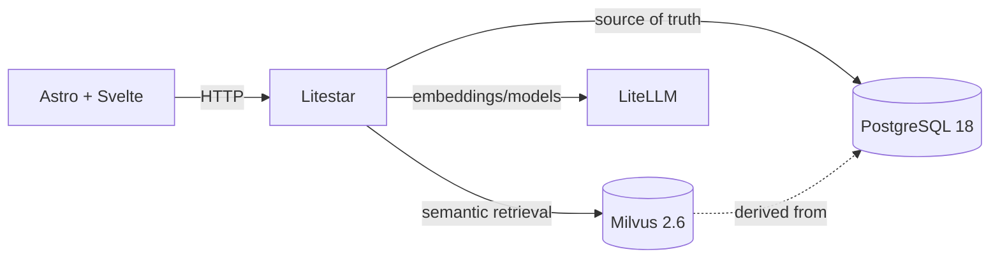

# TebaAI Architecture

This directory defines TebaAI architecture, stable operating rules and domain boundaries that must remain aligned with implementation.

## Project Map

The project separates runtime code, living architecture, decision records, technical status and generated evidence.

- `AGENTS.md`: agent operating rules.
- `lat.md/`: architecture invariants and canonical policies.
- `SrvRestAstroLS_v1/backend/`: Litestar backend.
- `SrvRestAstroLS_v1/astro/`: Astro and Svelte frontend.
- `SrvRestAstroLS_v1/docs/`: current and historical runtime status.
- `docs/adr/`: architecture decision records.
- `data/`: approved inputs, derived data and reports.

## Stack

The stack uses explicit boundaries between the web application, persistent truth, vector retrieval and model routing.

- Litestar with Python 3.12;
- Astro 7 and Svelte 5;
- PostgreSQL 18 with `psycopg 3 async`;
- Milvus 2.6 as derived vector index;
- LiteLLM for embeddings and future model routing;
- Playwright + Chromium as browser gate.

## Architecture

The runtime keeps PostgreSQL authoritative while Milvus accelerates semantic retrieval and LiteLLM hides provider-specific model access.

See [[tebaai-knowledge-map]] for the navigable knowledge tree.

## Conventions

Stable naming and entrypoint conventions prevent project identity from leaking across repositories.

- visible brand: `Teba AI`;
- technical identifier: `tebaai`;
- environment prefix: `TEBAAI_`;
- backend port: `7008`;
- frontend port: `3008`;
- ASGI entrypoint: `SrvRestAstroLS_v1/backend/ls_iMotorSoft_Srv01.py`;
- no `backend/app.py` without ADR.

## External Services

PostgreSQL, Milvus and LiteLLM are permanent external services and are never managed automatically by agents.

Service-dependent work follows [[service-preflight-methodology]].

## Canonical Documents

Each architecture concern has one canonical LAT source and may be anchored from code with `@lat`.

- [[global-configuration-facade-policy]]
- [[postgres-driver-policy]]
- [[authentication-security-policy]]
- [[library-retrieval-models-policy]]
- [[breslov-test-corpus-policy]]
- [[bibliographic-metadata-audit]]
- [[page-aware-metadata-mapping-audit]]
- [[page-metadata-enrichment]]
- [[page-mapping-failure-diagnosis]]
- [[service-preflight-methodology]]
- [[browser-mcp-validation-policy]]
- [[root-cause-debugging-policy]]
- [[mermaid-diagram-policy]]
- [[tebaai-knowledge-map]]
- [[status_actual]]

## Configuration Guardrail

Global configuration has a single backend reader and a public-only frontend facade.

Before changing environment variables, auth settings, PostgreSQL, Milvus, LiteLLM, `globalVar.py` or `global.js`, read [[global-configuration-facade-policy]].

## Development Flow

Development begins from current repository state and loads only the canonical context required by the task.

1. Read `AGENTS.md` and `SrvRestAstroLS_v1/docs/status_actual.md`.
2. Check branch and worktree state.
3. Read the relevant LAT or ADR source.
4. Keep changes scoped and preserve unrelated work.
5. Run focused validation, `git diff --check` and `lat check` when applicable.

## Status Convention

Status files describe current closing state; they do not duplicate architecture or serve as an append-only diary.

- runtime current state: `SrvRestAstroLS_v1/docs/status_actual.md`;
- frozen runtime history: `SrvRestAstroLS_v1/docs/status_historico_hasta_2026-06-28.md`;
- architecture current state: `lat.md/status_actual.md`.

## Completion Criteria

A phase closes only when implementation, documentation and validation agree and limitations are recorded explicitly.

No HTTP 200, previous status entry or exploratory browser run is sufficient by itself to declare a functional PASS.
