# TebaAI Architecture

This directory contains living architecture and stable operating rules for
TebaAI.

## Project Map

- `AGENTS.md`: required operating instructions for agents.
- `.agents/skills/tebaai-project/SKILL.md`: local project skill.
- `lat.md/`: architecture invariants and canonical policies.
- `SrvRestAstroLS_v1/backend/`: Litestar backend.
- `SrvRestAstroLS_v1/astro/`: Astro.js + Svelte 5 frontend.
- `SrvRestAstroLS_v1/docs/`: technical runtime status.
- `SrvRestAstroLS_v1/lab/`: isolated experiments.
- `docs/`: ADRs, strategy, business, UX and templates.
- `data/`: corpus input, processed outputs and generated reports.

## Stack

- Backend: Litestar.
- Backend entrypoint: `SrvRestAstroLS_v1/backend/ls_iMotorSoft_Srv01.py`.
- ASGI object: `app`.
- Frontend: Astro.js + Svelte 5 runes.
- Package manager: pnpm.
- E2E gate: Playwright + Chromium.
- Diagrams: Mermaid source in Git.

## Architecture

```mermaid
flowchart LR
  subgraph Frontend["Frontend &#40;Astro 7 + Svelte 5&#41;"]
    A1["Astro pages"]
    A2["Svelte components"]
    A3["Tailwind CSS 4 + DaisyUI 5"]
  end

  subgraph Backend["Backend &#40;Litestar&#41;"]
    B1["Routes"]
    B2["Services"]
    B3["Repositories"]
    B4["Schemas &#40;Pydantic v2&#41;"]
  end

  subgraph External["External Services"]
    C1["PostgreSQL 18<br/>pgvector"]
    C2["Milvus 2.6<br/>Vector store"]
    C3["LiteLLM<br/>LLM proxy"]
  end

  Frontend -- "HTTP /api" --> Backend
  Backend -- "psycopg 3 async" --> C1
  Backend -- "pymilvus 2.6" --> C2
  Backend -- "litellm SDK" --> C3
```

## Conventions

- Visible brand: `Teba AI`.
- Technical identifier: `tebaai`.
- Environment prefix: `TEBAAI_`.
- Backend port: `7008`.
- Astro port: `3008`.
- No `backend/app.py` unless a future ADR approves the exception.

## External Services

PostgreSQL, Milvus and LiteLLM are external permanent services. They must not
be started, stopped or restarted automatically.

## Canonical Documents

- [[service-preflight-methodology]]
- [[postgres-driver-policy]]
- [[global-configuration-facade-policy]]
- [[browser-mcp-validation-policy]]
- [[mermaid-diagram-policy]]
- [[root-cause-debugging-policy]]
- [[library-retrieval-models-policy]]
- [[bibliographic-metadata-audit]]
- [[page-aware-metadata-mapping-audit]]
- `docs/adr/ADR-001-new-project-bootstrap-template.md`
- `docs/adr/ADR-002-global-configuration-facade.md`

## Configuration Guardrail

Before modifying global configuration, environment variables, PostgreSQL,
Milvus, LiteLLM, auth, `globalVar.py` or `global.js`, read
[`global-configuration-facade-policy.md`](global-configuration-facade-policy.md).

Only `core/config.py` should read environment variables directly. `globalVar.py`
is a stable configuration facade and must not create connections, pools,
clients, network calls or other infrastructure side effects. `global.js` is for
public frontend configuration only and must never contain secrets.

## Development Flow

1. Read `AGENTS.md`.
2. Read `.agents/skills/tebaai-project/SKILL.md`.
3. Read this index and `lat.md/status_actual.md` for architecture changes.
4. Check `git status`.
5. Keep changes small and update status files when phases close.

## Status Actual Convention

Use `status_actual.md` as a closing-state log, not as a diary. The main runtime
technical log is `SrvRestAstroLS_v1/docs/status_actual.md` and it covers
backend, Astro/Svelte frontend and frontend/backend integration together.

`lat.md/status_actual.md` records architecture invariants, canonical policies
and LAT document changes. Create local `status_actual.md` files under `docs/`
or `data/` only for active directories with real content.

## Completion Criteria

A phase is not complete until the relevant code or documentation exists,
validation was run or explicitly skipped with reason, and no external services
were modified without explicit instruction.
