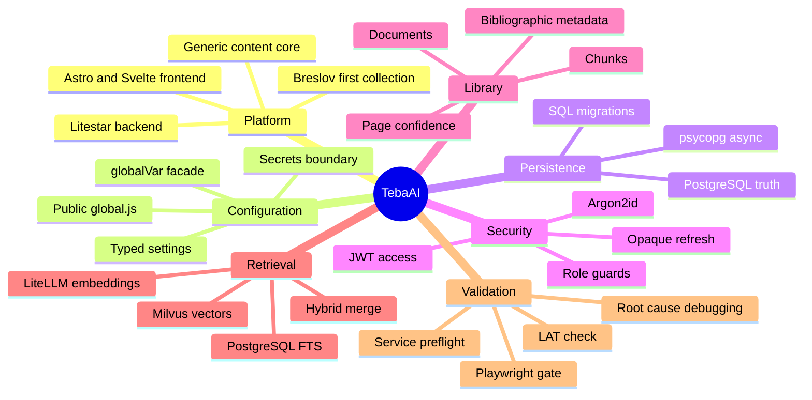

# TebaAI Knowledge Map

This map provides a compact navigation tree for the canonical architecture and operational policies in `lat.md/`.

## Map

The tree groups stable concepts without replacing their canonical documents.

## Canonical References

Every branch resolves to one or more stable documents.

- platform and conventions: [[lat]];
- configuration: [[global-configuration-facade-policy]];
- persistence: [[postgres-driver-policy]];
- security: [[authentication-security-policy]];
- library and retrieval: [[library-retrieval-models-policy]], [[bibliographic-metadata-audit]], [[page-aware-metadata-mapping-audit]], [[page-metadata-enrichment]];
- validation: [[service-preflight-methodology]], [[browser-mcp-validation-policy]], [[root-cause-debugging-policy]];
- diagrams: [[mermaid-diagram-policy]].

## Maintenance

The map changes only when a stable concept or canonical document is added, removed or renamed.

Daily evidence and temporary tasks belong in status or reports, not in this tree.
